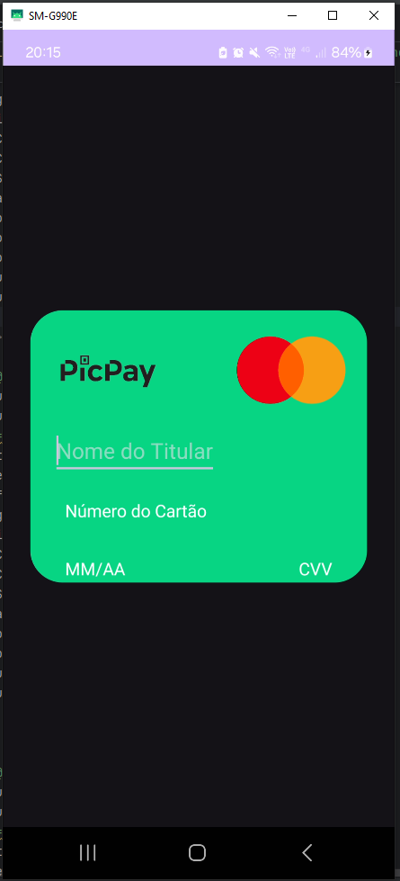
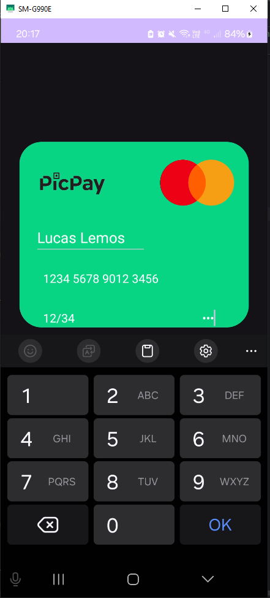

# 💳 Atividade 2: Criação e Design de Layout de Cartão de Crédito no Android Studio

Este projeto foi desenvolvido para a disciplina de **Programação para Dispositivos Móveis** do curso de **Análise e Desenvolvimento de Sistemas (6º período - IFTM)**.

## 🎯 Objetivo

Criar uma interface de cartão de crédito no Android Studio, com foco em **formatação automática** e **validação de campos**.

---

## ✨ Funcionalidades

- Campo para **número do cartão** com formatação automática (exemplo: `1234 5678 9012 3456`).
- Campo para **data de validade** com formatação automática no padrão `MM/AA`.
- Campo para **CVV** com máscara de até 3 dígitos.
- Campo para **nome do titular** aceitando apenas letras.
- Layout com **ícones de bandeiras** e visual semelhante a um cartão real.
- Interface criada com **ConstraintLayout** e customização com bordas arredondadas e sombras.

---

## 🧩 Validações Implementadas

- O **número do cartão** deve ter exatamente **16 dígitos**.
- O **nome do titular** deve ter **pelo menos 3 caracteres** e aceitar apenas letras e espaços.
- A **data de validade** segue o padrão obrigatório `MM/AA`.

---

## 🛠️ Tecnologias Utilizadas

- **Kotlin**
- **Android Studio**
- **ConstraintLayout**
- **TextWatcher** para máscaras de entrada.

---

## 📸 Screenshots

 

---

## 🚀 Resultado esperado

- Interface limpa e responsiva.
- Formatação automática de campos durante a digitação, seguindo o padrão de aplicativos de bancos.

---

> **IFTM - Instituto Federal do Triângulo Mineiro**  
> Disciplina: Programação para Dispositivos Móveis  
> 6º Período de ADS – 2025
